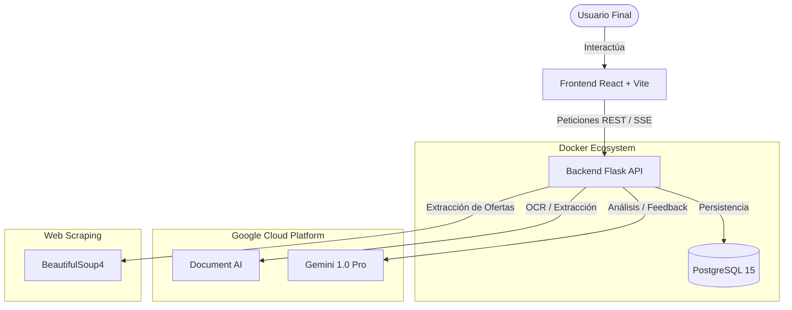
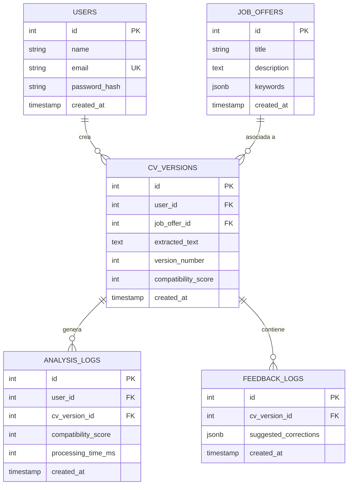

# 🛠️ Documentación Técnica - CVSmartAI

Este documento proporciona una visión profunda de la arquitectura, el modelo de datos y la interfaz de programación (API) de CVSmartAI.

---

## 1. Arquitectura del Sistema

El sistema sigue una arquitectura de microservicios dockerizados, comunicando un frontend moderno con un backend robusto que consume servicios de Inteligencia Artificial de Google Cloud.

---

## 2. Modelo de Datos (ERD)

La base de datos utiliza PostgreSQL para asegurar la integridad referencial y permitir el almacenamiento de datos complejos mediante tipos `JSONB`.

---

## 3. Referencia de la API (v1)

Todos los endpoints (excepto Login/Registro) requieren un token Bearer en el header `Authorization`.

### Autenticación
| Método | Endpoint | Descripción |
| :--- | :--- | :--- |
| `POST` | `/api/v1/users/register` | Registra un nuevo usuario y devuelve un JWT. |
| `POST` | `/api/v1/users/login` | Valida credenciales y devuelve un JWT. |

### Análisis de CV
| Método | Endpoint | Descripción |
| :--- | :--- | :--- |
| `POST` | `/api/v1/analyze` | **Streaming (SSE)**. Sube un PDF, extrae texto con DocAI y analiza con Gemini. |
| `POST` | `/api/v1/job-offers/extract` | Extrae y estructura información de una URL de oferta de empleo. |

### Historial y Evolución
| Método | Endpoint | Descripción |
| :--- | :--- | :--- |
| `GET` | `/api/v1/users/<id>/history` | Obtiene el historial cronológico de CVs de un usuario. |
| `GET` | `/api/v1/users/<id>/evolution` | Obtiene los datos de puntuación para gráficas de progreso. |

---

## 4. Stack Tecnológico

| Capa | Tecnología | Razón |
| :--- | :--- | :--- |
| **Frontend** | React 18 + Vite | Rapidez de desarrollo y renderizado eficiente. |
| **Backend** | Flask (Python) | Flexibilidad e integración nativa con librerías de IA y Scraping. |
| **Base de Datos** | PostgreSQL 15 | Soporte nativo para JSONB y robustez empresarial. |
| **IA** | Google Gemini | Potencia de procesamiento de lenguaje natural de última generación. |
| **OCR** | Google Document AI | Precisión superior en la extracción de texto desde PDFs complejos. |

---

## 5. Seguridad
- **JWT (JSON Web Tokens)**: Implementado para la gestión de sesiones sin estado.
- **Bcrypt (simulado)**: Las contraseñas se almacenan como hashes (pendiente de migración a Argon2 para Hito final).
- **Environment Variables**: Todas las claves sensibles se gestionan mediante el archivo `.env`.

---
